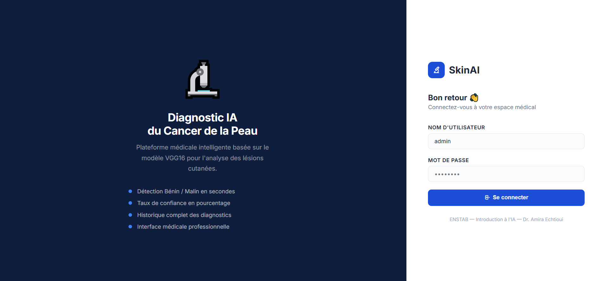
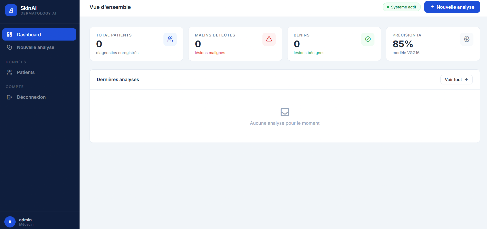
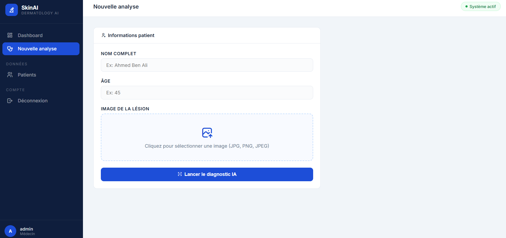
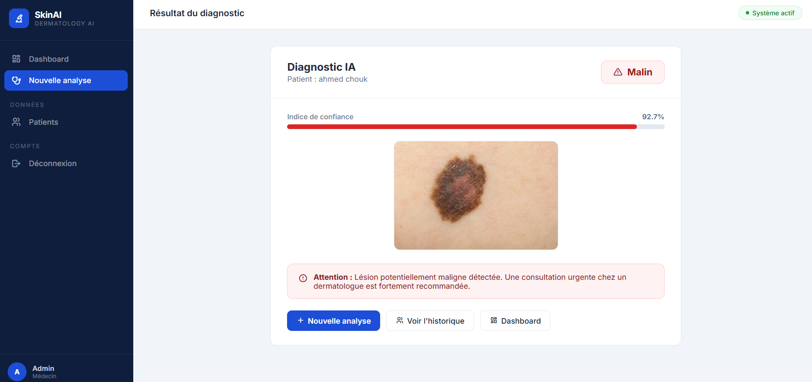
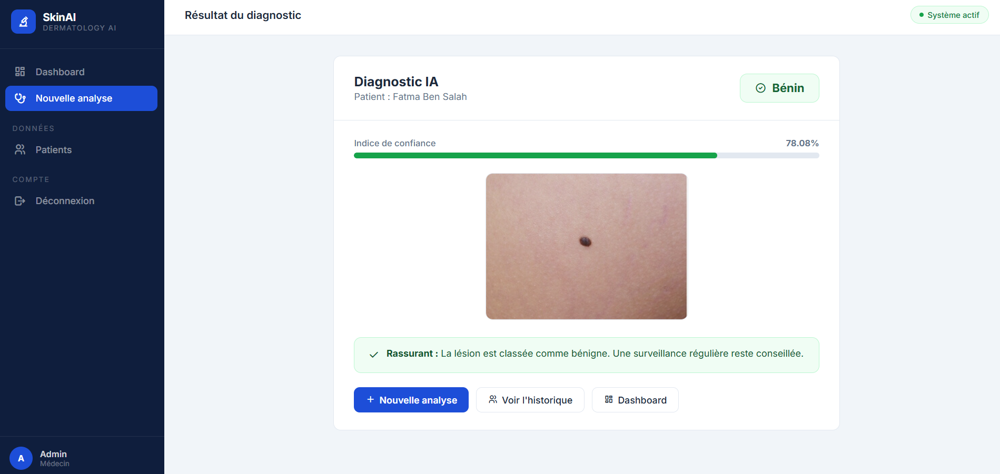
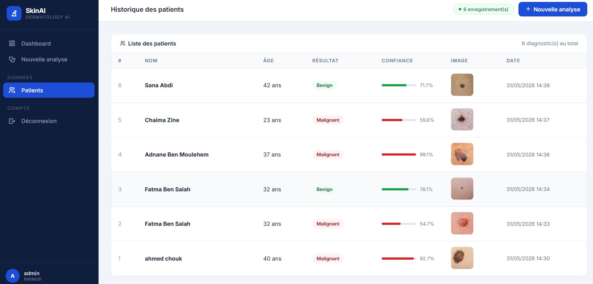

# SkinAI — Application Web de Diagnostic du Cancer de la Peau

Application web de diagnostic du cancer de la peau basée sur l'Intelligence Artificielle.
Réalisée par : Elaa Cherif

---

## Description

SkinAI est une application web developpée avec Python Flask integrant un modèle de Deep Learning (VGG16) pour le diagnostic automatique des lesions cutanées.

L'application permet à un professionnel de sante de :
- Se connecter via un système d'authentification securisé
- Soumettre l'image d'une lesion cutanée avec les informations du patient
- Obtenir un diagnostic IA : Benin ou Malin avec un taux de confiance
- Consulter l'historique complet des diagnostics enregistrés

---

## Captures d'ecran

### Page de connexion
Interface de login securisée avec un design medical professionnel. L'utilisateur entre son nom d'utilisateur et mot de passe pour accéder à la plateforme.



### Tableau de bord
Vue d'ensemble affichant les statistiques globales : nombre total de patients, cas malins detectés, cas benins, et la précision du modele IA.



### Analyse d'une image
Formulaire permettant de saisir les informations du patient (nom, age) et de télécharger une image de lesion cutanée pour analyse.



### Resultat du diagnostic : Cas malin
Affichage du résultat avec le diagnostic (Malin), le taux de confiance en pourcentage, l'image analysee et une recommandation medicale.



### Resultat du diagnostic : Cas benin
Affichage du résultat avec le diagnostic (Benin), le taux de confiance en pourcentage, l'image analysée et une recommandation de surveillance.



### Historique des patients
Tableau récapitulatif de tous les diagnostics enregistrés avec le nom, l'age, le résultat, la probabilité, l'image et la date de chaque analyse.



---

## Structure du projet

```
SKIN_CANCER_APP/
├── model/
│   └── vgg16_malignant_vs_benign.h5
├── static/
│   ├── style.css
│   └── uploads/
├── templates/
│   ├── login.html
│   ├── dashboard.html
│   ├── predict.html
│   ├── result.html
│   └── patients.html
├── screenshots/
├── app.py
├── database.sql
├── requirements.txt
└── README.md
```

---

## Technologies utilisees

- Python 3.x — Langage principal
- Flask — Framework web
- TensorFlow / Keras — Modele Deep Learning VGG16
- MySQL — Base de donnees
- Bootstrap 5 — Interface utilisateur
- HTML / CSS — Templates Jinja2

---

## Installation et lancement

### 1. Installer les dependances
```bash
pip install flask tensorflow numpy mysql-connector-python werkzeug
```

### 2. Configurer la base de données
Lancer XAMPP, ouvrir phpMyAdmin et executer le fichier database.sql

### 3. Placer le modele
Copier vgg16_malignant_vs_benign.h5 dans le dossier model/

### 4. Lancer l'application
```bash
python app.py
```

Ouvrir : http://localhost:5000

---

## Identifiants par defaut

- Nom d'utilisateur : admin
- Mot de passe : 1234

---

## Modele IA

- Architecture : VGG16 (Transfer Learning, poids ImageNet)
- Dataset : Images de lesions cutanees (Benin / Malin)
- Entrainement : Google Colab, 10 epoques
- Classes : Benign (0) / Malignant (1)
